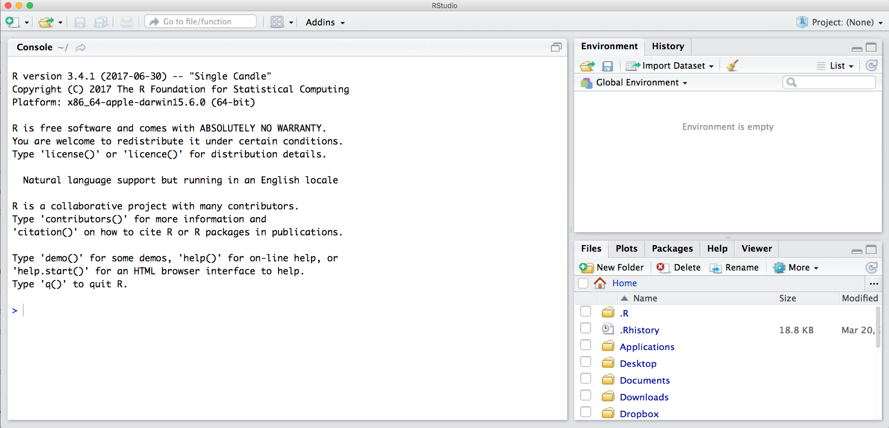
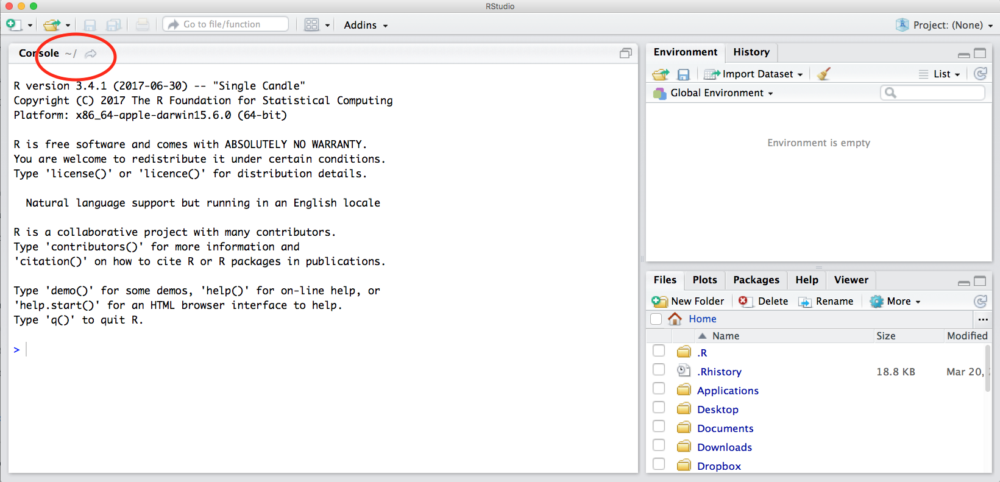
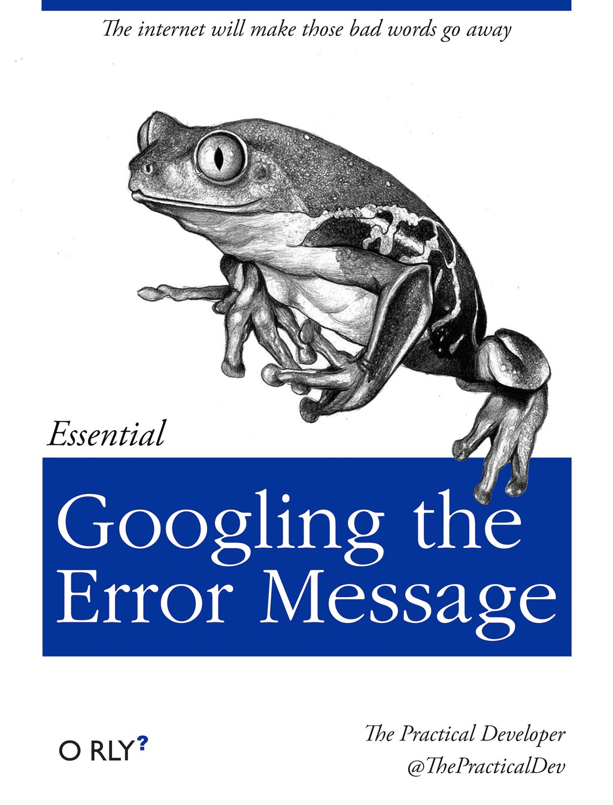
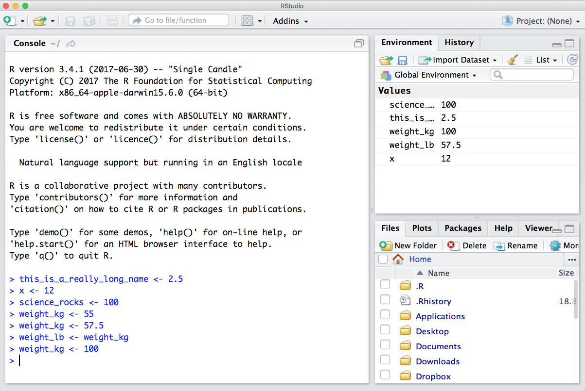
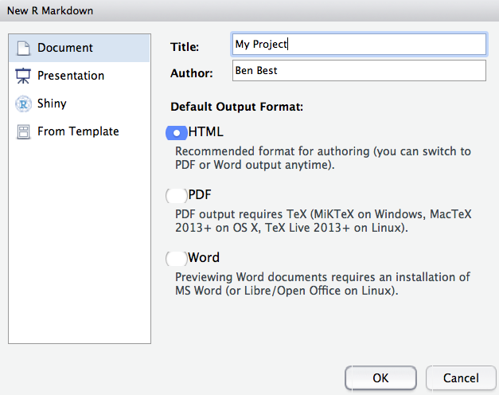

# Introduction to R and RMarkdown

## Learning Objectives

In this lesson we will:

- get oriented to the RStudio interface
- work with R in the console
- explore RMarkdown
- be introduced to built-in R functions
- learn to use the help pages

## Introduction and Motivation

There is a vibrant community out there that is collectively developing increasingly easy to use and powerful open source programming tools. The changing landscape of programming is making learning how to code easier than it ever has been. Incorporating programming into analysis workflows not only makes science more efficient, but also more computationally reproducible. In this course, we will use the programming language R, and the accompanying integrated development environment (IDE) RStudio. R is a great language to learn for data-oriented programming because it is widely adopted, user-friendly, and (most importantly) open source!

So what is the difference between R and RStudio? Here is an analogy to start us off. **If you were a pilot, R is an airplane.** You can use R to go places! With practice you'll gain skills and confidence; you can fly further distances and get through tricky situations. You will become an awesome pilot and can fly your plane anywhere. 

And **if R were an airplane, RStudio is the airport**. RStudio provides support! Runways, communication, community, and other services, and just makes your overall life easier. So it's not just the infrastructure (the user interface or IDE), although it is a great way to learn and interact with your variables, files, and interact directly with GitHub. It's also data science philosophy, R packages, community, and more. So although you can fly your plane without an airport and we could learn R without RStudio, that's not what we're going to do. We are going to take advantage of the great RStudio support, and learn R and RStudio together.

Something else to start us off is to mention that you are learning a new language here. It's an ongoing process, it takes time, you'll make mistakes, it can be frustrating, but it will be overwhelmingly awesome in the long run. We all speak at least one language; it's a similar process, really. And no matter how fluent you are, you'll always be learning, you'll be trying things in new contexts, learning words that mean the same as others, etc, just like everybody else. And just like any form of communication, there will be miscommunications that can be frustrating, but hands down we are all better off because of it. 

While language is a familiar concept, programming languages are in a different context from spoken languages, but you will get to know this context with time. For example: you have a concept that there is a first meal of the day, and there is a name for that: in English it's "breakfast". So if you're learning Spanish, you could expect there is a word for this concept of a first meal. (And you'd be right: 'desayuno'). **We will get you to expect that programming languages also have words (called functions in R) for concepts as well**. You'll soon expect that there is a way to order values numerically. Or alphabetically. Or search for patterns in text. Or calculate the median. Or reorganize columns to rows. Or subset exactly what you want. We will get you increase your expectations and learn to ask and find what you're looking for.


### Resources

This lesson is a combination of excellent lessons by others. Huge thanks to Julie Lowndes for writing most of this content and letting us build on her material, which in turn was built on Jenny Bryan's materials. I definitely recommend reading through the original lessons and using them as reference:   

- [Julie Lowndes' Data Science Training for the Ocean Health Index](http://ohi-science.org/data-science-training/)
- [R, RStudio, RMarkdown](http://ohi-science.org/data-science-training/rstudio.html)
- [Programming in R](http://ohi-science.org/data-science-training/programming.html)
- [Jenny Bryan's lectures from STAT545 at UBC](https://stat545-ubc.github.io/)
- [R basics, workspace and working directory, RStudio projects](http://stat545-ubc.github.io/block002_hello-r-workspace-wd-project.html)
- [Basic care and feeding of data in R](http://stat545-ubc.github.io/block006_care-feeding-data.html)


RStudio has great resources as well: 

- [webinars](https://www.rstudio.com/resources/webinars/) 
- [cheatsheets](https://www.rstudio.com/resources/cheatsheets/)

Finally, Hadley Wickham's book R for Data Science is a great resource to get more in depth. 

-[R for Data Science](http://r4ds.had.co.nz/)

## R at the console

Launch RStudio/R.



Notice the default panes:

  * Console (entire left)
  * Environment/History (tabbed in upper right)
  * Files/Plots/Packages/Help (tabbed in lower right)

FYI: you can change the default location of the panes, among many other things: [Customizing RStudio](https://support.rstudio.com/hc/en-us/articles/200549016-Customizing-RStudio). 


An important first question: **where are we?** 

If you've just opened RStudio for the first time, you'll be in your Home directory. This is noted by the `~/` at the top of the console. You can see too that the Files pane in the lower right shows what is in the Home directory where you are. You can navigate around within that Files pane and explore, but note that you won't change where you are: even as you click through you'll still be Home: `~/`. 




OK let's go into the Console, where we interact with the live R process.

We use R to calculate things for us, so let's do some simple math.


```r
3*4
```

```
## [1] 12
```

You can assign the value of that mathematic operation to a variable, or object, in R. You do this using the assignment operator, `<-`.

Make an assignment and then inspect the object you just created.


```r
x <- 3 * 4
x
```

```
## [1] 12
```
In my head I hear, e.g., "x gets 12".

All R statements where you create objects -- "assignments" -- have this form: `objectName <- value`.  

I'll write it in the console with a hash `#`, which is the way R comments so it won't be evaluated. 

```r
## objectName <- value

## This is also how you write notes in your code to explain what you are doing.
```

Object names cannot start with a digit and cannot contain certain other characters such as a comma or a space. You will be wise to adopt a [convention for demarcating words](http://en.wikipedia.org/wiki/Snake_case) in names.


```r
# i_use_snake_case
# other.people.use.periods
# evenOthersUseCamelCase
```

Make an assignment

```r
this_is_a_really_long_name <- 2.5
```

To inspect this variable, instead of typing it, we can press the up arrow key and call your command history, with the most recent commands first. Let's do that, and then delete the assignment: 


```r
this_is_a_really_long_name
```

```
## [1] 2.5
```

Another way to inspect this variable is to begin typing `this_`...and RStudio will automagically have suggested completions for you that you can select by hitting the tab key, then press return. 

One more:

```r
science_rocks <- "yes it does!"
```

You can see that we can assign an object to be a word, not a number. In R, this is called a "string", and R knows it's a word and not a number because it has quotes `" "`. You can work with strings in your data in R pretty easily, thanks to the [`stringr`](http://stringr.tidyverse.org/) and [`tidytext`](https://github.com/juliasilge/tidytext#tidytext-text-mining-using-dplyr-ggplot2-and-other-tidy-tools) packages. We won't talk about strings very much specifically, but know that R can handle text, and it can work with text and numbers together. 

Strings and numbers lead us to an important concept in programming: that there are different "classes" or types of objects. An object is a variable, function, data structure, or method that you have written to your environment. You can see what objects you have loaded by looking in the "environment" pane in RStudio. The operations you can do with an object will depend on what type of object it is. This makes sense! Just like you wouldn't do certain things with your car (like use it to eat soup), you won't do certain operations with character objects (strings), for example.

Try running the following line in your console:


```r
"Hello world!" * 3
```

What happened? Why?


You may have noticed that when assigning a value to an object, R does not print anything. You can force R to print the value by using parentheses or by typing the object name:


```r
weight_kg <- 55    # doesn't print anything
(weight_kg <- 55)  # but putting parenthesis around the call prints the value of `weight_kg`
```

```
## [1] 55
```

```r
weight_kg          # and so does typing the name of the object
```

```
## [1] 55
```

Now that R has `weight_kg` in memory, we can do arithmetic with it. For
instance, we may want to convert this weight into pounds (weight in pounds is 2.2 times the weight in kg):


```r
2.2 * weight_kg
```

```
## [1] 121
```

We can also change a variable's value by assigning it a new one:


```r
weight_kg <- 57.5
2.2 * weight_kg
```

```
## [1] 126.5
```

This means that assigning a value to one variable does not change the values of
other variables.  For example, let's store the animal's weight in pounds in a new
variable, `weight_lb`:


```r
weight_lb <- 2.2 * weight_kg
```

and then change `weight_kg` to 100.


```r
weight_kg <- 100
```

What do you think is the current content of the object `weight_lb`? 126.5 or 220? Why?

### Error messages are your friends

Implicit contract with the computer / scripting language: Computer will do tedious computation for you. In return, you will be completely precise in your instructions. Typos matter. Case matters. Pay attention to how you type.

Remember that this is a language, not unsimilar to English! There are times you aren't understood -- it's going to happen. There are different ways this can happen. Sometimes you'll get an error. This is like someone saying 'What?' or 'Pardon'? Error messages can also be more useful, like when they say 'I didn't understand this specific part of what you said, I was expecting something else'. That is a great type of error message. Error messages are your friend. Google them (copy-and-paste!) to figure out what they mean. 

<div style="width:400px">

</div>

And also know that there are errors that can creep in more subtly, without an error message right away, when you are giving information that is understood, but not in the way you meant. Like if I'm telling a story about tables and you're picturing where you eat breakfast and I'm talking about data. This can leave me thinking I've gotten something across that the listener (or R) interpreted very differently. And as I continue telling my story you get more and more confused... So write clean code and check your work as you go to minimize these circumstances!

### Logical operators and expressions

A moment about **logical operators and expressions**. We can ask questions about the objects we just made. 

- `==` means 'is equal to'
- `!=` means 'is not equal to'
- `<` means ` is less than'
- `>` means ` is greater than'
- `<=` means ` is less than or equal to'
- `>=` means ` is greater than or equal to'

```r
weight_kg == 2
```

```
## [1] FALSE
```

```r
weight_kg >= 30
```

```
## [1] TRUE
```

```r
weight_kg != 5
```

```
## [1] TRUE
```

> Shortcuts
You will make lots of assignments and the operator `<-` is a pain to type. Don't be lazy and use `=`, although it would work, because it will just sow confusion later. Instead, utilize **RStudio's keyboard shortcut: Alt + - (the minus sign)**.
Notice that RStudio automagically surrounds `<-` with spaces, which demonstrates a useful code formatting practice. Code is miserable to read on a good day. Give your eyes a break and use spaces.
RStudio offers many handy [keyboard shortcuts](https://support.rstudio.com/hc/en-us/articles/200711853-Keyboard-Shortcuts). Also, Alt+Shift+K brings up a keyboard shortcut reference card.


### Clearing the environment
Now look at the objects in your environment (workspace) -- in the upper right pane. The workspace is where user-defined objects accumulate. 



You can also get a listing of these objects with a few different R commands:


```r
objects()
```

```
## [1] "science_rocks"              "this_is_a_really_long_name"
## [3] "weight_kg"                  "weight_lb"                 
## [5] "x"
```

```r
ls()
```

```
## [1] "science_rocks"              "this_is_a_really_long_name"
## [3] "weight_kg"                  "weight_lb"                 
## [5] "x"
```

If you want to remove the object named `weight_kg`, you can do this:


```r
rm(weight_kg)
```

To remove everything:


```r
rm(list = ls())
```

or click the broom in RStudio's Environment pane.

## RMarkdown

Now that we know some basic R syntax, let's learn a little about RMarkdown. You will drive yourself crazy (and fail to generate a reproducible workflow!) running code directly in the console. RMarkdown is really key for collaborative research, so we're going to get started with it early and then use it for the rest of the course. 

An RMarkdown file will allow us to weave markdown text with chunks of R code to be evaluated and output content like tables and plots.

File -> New File -> RMarkdown... -> Document of output format HTML, OK.

<div style="width:300px">

</div>

You can give it a Title like "My Project". Then click OK. 

OK, first off: by opening a file, we are seeing the 4th pane of the RStudio console, which is essentially a text editor. This lets us organize our files within RStudio instead of having a bunch of different windows open.

Let's have a look at this file — it's not blank; there is some initial text is already provided for you. Notice a few things about it: 

- There are white and grey sections. R code is in grey sections, and other text is in white. 


<br>

Let's go ahead and "Knit HTML" by clicking the blue yarn at the top of the RMarkdown file. When you first click this button, RStudio will prompt you to save this file. Create a new folder for it somewhere that you will be able to find again (such as your Desktop or Documents), and name that folder something you'll remember (like `training_files`).

<br>


What do you notice between the two? 

Notice how the grey **R code chunks** are surrounded by 3 backticks and `{r LABEL}`. These are evaluated and return the output text in the case of `summary(cars)` and the output plot in the case of `plot(pressure)`.

Notice how the code `plot(pressure)` is not shown in the HTML output because of the R code chunk option `echo=FALSE`.

More details...

This RMarkdown file has 2 different languages within it: **R** and **Markdown**. 

We don't know that much R yet, but you can see that we are taking a summary of some data called 'cars', and then plotting. There's a lot more to learn about R, and we'll get into it for the next few days. 

The second language is Markdown. This is a formatting language for plain text, and there are only about 15 rules to know. 

Notice the syntax for:

- **headers** get rendered at multiple levels: `#`, `##`
- **bold**: `**word**`

There are some good [cheatsheets](https://github.com/adam-p/markdown-here/wiki/Markdown-Here-Cheatsheet) to get you started, and here is one built into RStudio: Go to Help > Markdown Quick Reference
<br />
<br />

**Important**: note that the hashtag `#` is used differently in Markdown and in R: 

- in R, a hashtag indicates a comment that will not be evaluated. You can use as many as you want: `#` is equivalent to `######`. It's just a matter of style.
- in Markdown, a hashtag indicates a level of a header. And the number you use matters: `#` is a "level one header", meaning the biggest font and the top of the hierarchy. `###` is a level three header, and will show up nested below the `#` and `##` headers.

Learn more: http://rmarkdown.rstudio.com/

### Your Turn

1. In Markdown, Write some italic text, and make a numbered list. And add a few subheaders.
Use the Markdown Quick Reference (in the menu bar: Help > Markdown Quick Reference). 
1. Reknit your html file. 


### Code chunks

OK. Now let's practice with some of those commands.

Create a new chunk in your RMarkdown first in one of these ways: 

- click "Insert > R" at the top of the editor pane
- type by hand 
   \```{r}
   \```
- if you haven't deleted a chunk that came with the new file, edit that one

Now, let's write some R code. 

```
x <- 4*3
x
```

Now, hitting return does not execute this command; remember, it's just a text file. To execute it, we need to get what we typed in the the R chunk (the grey R code) down into the console. How do we do it? There are several ways (let's do each of them):

1. copy-paste this line into the console.
1. select the line (or simply put the cursor there), and click 'Run'. This is available from 
    a. the bar above the file (green arrow)
    b. the menu bar: Code > Run Selected Line(s)
    c. keyboard shortcut: command-return
1. click the green arrow at the right of the code chunk

### Your turn

Add a few more commands to your file. Execute them by trying the three ways above. Then, save your R Markdown file. 


## R functions, help pages

So far we've learned some of the basic syntax and concepts of R programming, how to navigate RStudio, and RMarkdown, but we haven't done any complicated or interesting programming processes yet. This is where functions come in!

R has a mind-blowing collection of built-in functions that are used with the same syntax: function name with parentheses around what the function needs in order to do what it was built to do. When you type a function like this, we say we are "calling the function". `function_name(argument1 = value1, argument2 = value2, ...)`. 

As our first function, we will introduce `read.csv`, which will be in the first lines of many of your future scripts. It does exactly what it says, it reads in a csv file to R, but we don't quite know how to use it yet. The help pages in RStudio will help us with this!

To access the help page for `read.csv`, enter the following into your console:


```r
?read.csv
```

The help pane will show up in the lower right hand corner of your RStudio.

You can see from this pane that the help page for this function is actually for a family of related functions that read in data. The help page tells the name of the package in the top left, and is broken down into sections:

 - Description: An extended description of what the function does.
 - Usage: The arguments of the function(s) and their default values.
 - Arguments: An explanation of the data each argument is expecting.
 - Details: Any important details to be aware of.
 - Value: The data the function returns.
 - See Also: Any related functions you might find useful.
 - Examples: Some examples for how to use the function.

The help for `read.csv` has a lot of information in it, as this function has a lot of arguments, but the first one seems pretty critical. We have to tell it what file to look for. Let's get a file!

### Download a file from the Arctic Data Center

Navigate to this dataset by Craig Tweedie that is published on the Arctic Data Center. [Craig Tweedie. 2009. North Pole Environmental Observatory Bottle Chemistry. Arctic Data Center. doi:10.18739/A25T3FZ8X.](http://doi.org/10.18739/A25T3FZ8X), and download the first csv file called "BGchem2008data.csv"

Move this file from your Downloads folder into a place you can more easily find it. I recommend creating a folder called `data` in your previously-created directory `training_files`, and putting the file there.

### Use a function to read a file into R

Now we have to tell `read.csv` how to find the file. We do this using the `file` argument which you can see in usage section in the help page. In RMarkdown, you can either use absolute paths (which will start with your home directory `~/`) or paths **relative to the location of the RMarkdown.** RStudio and RMarkdown have some great autocomplete capabilities when using relative paths, so we will go that route. Assuming you have moved your file to a folder within `training_files` called `data`, your `read.csv` call will look like this:


```r
bg_chem <- read.csv("data/BGchem2008data.csv")
```

You should now have an object of the class `data.frame` in your environment called `bg_chem`. Check your environment pane to ensure this is true.

Note that in the help page there are a whole bunch of arguments that we didn't use in the call above. Some of the arguments in function calls are optional, and some are required. Optional arguments will be shown in the usage section with a `name = value` pair, with the default value shown. If you do not specify a `name = value` pair for that argument in your function call, the function will assume the default value (example: `header = TRUE` for `read.csv`). Required arguments will only show the name of the argument, without a value. Note that the only required argument for `read.csv` is `file`.

You can always specify arguments in `name = value` form. But if you do not, R attempts to resolve by position. So above, it is assumed that we want `file = "data/BGchem2008data.csv"`, since file is the first argument. If we wanted to add another argument, say `stringsAsFactors`, we need to specify it explicitly using the `name = value` pair, since the second argument is `header`. For functions I call often, I use this resolve by position for the first argument or maybe the first two. After that, I always use `name = value`.

Many R users (including myself) will override the default `stringsAsFactors` argument using the following call:


```r
bg_chem <- read.csv("data/BGchem2008data.csv", stringsAsFactors = FALSE)
```

### Your turn

> Exercise: Talk to your neighbor(s) and look up the help file for a function that you know or expect to exist. Here are some ideas: `?getwd()`, `?plot()`,  `min()`, `max()`, `?mean()`, `?log()`).

And there's also help for when you only sort of remember the function name: double-questionmark:

```r
??install 
```

Not all functions have (or require) arguments:

```r
date()
```

```
## [1] "Mon Feb 11 14:45:35 2019"
```


## Using `data.frames`

A `data.frame` is a two dimensional data structure in R that mimics spreadsheet behavior. It is a collection of rows and columns of data, where each column has a name and represents a variable, and each row represents a measurement of that variable. When we ran `read.csv`, the object `bg_chem` that we created is a `data.frame`. There are a a bunch of ways R and RStudio help you explore data frames. Here are a few, give them each a try:

- click on the word `bg_chem` in the environment pane
- click on the arrow next to `bg_chem` in the environment pane
- execute `head(bg_chem)` in the console
- execute `View(bg_chem)` in the console

Usually we will want to run functions on individual columns in a `data.frame`. To call a specific column, we use the list subset operator `$`. Say you want to look at the first few rows of the `Date` column only. This would do the trick:


```r
head(bg_chem$Date)
```

```
## [1] "2008-03-21" "2008-03-21" "2008-03-21" "2008-03-21" "2008-03-21"
## [6] "2008-03-22"
```

How about calculating the mean temperature of all the CTD samples?


```r
mean(bg_chem$CTD_Temperature)
```

```
## [1] -0.9646915
```

Or, if we want to save this to a variable to use later:


```r
mean_temp <- mean(bg_chem$CTD_Temperature)
```

You can also create basic plots using the list subset operator.


```r
plot(bg_chem$CTD_Depth, bg_chem$CTD_Temperature)
```


There are many more advancted tools and functions in R that will enable you to make better plots using cleaner syntax, we will cover some of these later in the course. 

### Your Turn

> Exercise: Spend a few minutes exploring this dataset. Try out different functions on columns using the list subset operator and experiment with different plots. 

## Troubleshooting

Here are two common errors for new users:

### I just entered a command and nothing is happening

It may be because you didn't complete a command: is there a little `+` in your console? R is saying that it is waiting for you to finish. In the example below, I need to close that parenthesis.


```r
> x <- seq(1, 10
+ 
```

You can either just type the closing parentheses here and push return, or push the `esc` button twice.

### R says my object is not found

New users will frequently see errors that look like this: `Error in mean(myobject) : object 'myobject' not found`

This means that you do not have an object called `myobject` saved in your environment. The common reasons for this are:

- **typeo**: make sure your object name is spelled exactly like what shows up in the console. Remember R is case sensitive.
- **not writing to a variable**: note that the object is only saved in the environment if you use the assignment operator, eg: `myobject <- read.csv(...)`
- **not executing the line in your RMarkdown**: remember that writing a line of code in RMarkdown is not the same as writing in the console, you have to execute the line of code using command + enter, running the chunk, or one of the other ways outlined in the RMarkdown section of this training


