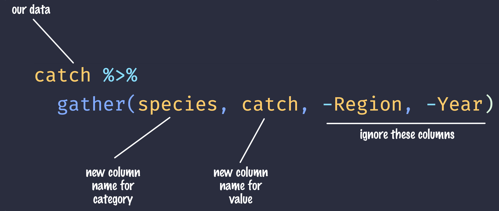

# Lecture 4 -  Data Cleaning and Manipulation

## Learning Objectives

In this lesson, you will learn:

- What the Split-Apply-Combine strategy is and how it applies to data
- The difference between wide vs. tall table formats and how to convert between them
- How to use `dplyr` and `tidyr` to clean and manipulate data for analysis
- How to join multiple `data.frame`s together using `dplyr`

## Introduction

The data we get to work with are rarely, if ever, in the format we need to do our analyses.
It's often the case that one package requires data in one format, while another package requires the data to be in another format.
To be efficient analysts, we should have good tools for reformatting data for our needs so we can do our actual work like making plots and fitting models.
The `dplyr` and `tidyr` R packages provide a fairly complete and extremely powerful set of functions for us to do this reformatting quickly and learning these tools well will greatly increase your efficiency as an analyst.

Analyses take many shapes, but they often conform to what is known as the Split-Apply-Combine strategy.
This strategy follows a usual set of steps:

- **Split**: Split the data into logical groups (e.g., area, stock, year)
- **Apply:** Calculate some summary statistic on each group (e.g. mean total length by year)
- **Combine:** Combine the groups back together into a single table


As shown above (Figure 1), our original table is split into groups by `year`, we calculate the mean length for each group, and finally combine the per-year means into a single table.

`dplyr` provides a fast and powerful way to express this.
Let's look at a simple example of how this is done:

Assuming our length data is already loaded in a `data.frame` called `length_data`:

| year| length_cm|
|----:|---------:|
| 1991|  5.673318|
| 1991|  3.081224|
| 1991|  4.592696|
| 1992|  4.381523|
| 1992|  5.597777|
| 1992|  4.900052|
| 1992|  4.139282|
| 1992|  5.422823|
| 1992|  5.905247|
| 1992|  5.098922|

We can do this calculation using `dplyr` like this:


```r
length_data %>% 
  group_by(year) %>% 
  summarise(mean_length_cm = mean(length_cm))
```

Another exceedingly common thing we need to do is "reshape" our data.
Let's look at an example table that is in what we will call "wide" format:

| site   | 1990 | 1991 | ... | 1993 |
|--------|------|------|-----|------|
| gold   | 100  | 118  | ... | 112  |
| lake   | 100  | 118  | ... | 112  |
| ...    | ...  | ...  | ... | ...  |
| dredge | 100  | 118  | ... | 112  |

You are probably quite familiar with data in the above format, where values of the variable being observed are spread out across columns (Here: columns for each year).
Another way of describing this is that there is more than one measurement per row.
This wide format works well for data entry and sometimes works well for analysis but we quickly outgrow it when using R.
For example, how would you fit a model with year as a predictor variable?
In an ideal world, we'd be able to just run:


```r
lm(length ~ year)
```

But this won't work on our wide data because `lm` needs `length` and `year` to be columns in our table.

Or how would we make a separate plot for each year?
We could call `plot` one time for each year but this is tedious if we have many years of data and hard to maintain as we add more years of data to our dataset.

The `tidyr` package allows us to quickly switch between wide format and what is called tall format using the `gather` function:


```r
site_data %>% 
  gather(year, length, -site)
```

| site   | year | length |
|--------|------|-------:|
| gold   | 1990 |    101 |
| lake   | 1990 |    104 |
| dredge | 1990 |    144 |
| ...    | ...  |    ... |
| dredge | 1993 |    145 |

In this lesson we're going to walk through the functions you'll most commonly use from the `dplyr` and `tidyr` packages:

- `dplyr`
    - `mutate()`
    - `group_by()`
    - `summarise()`
    - `select()`
    - `filter()`
    - `arrange()`
    - `left_join()`
    - `rename()`
- `tidyr`
    - `gather()`
    - `spread()`
    - `extract()`
    - `separate()`

## Setup

Let's start going over the most common functions you'll use from the `dplyr` package.
To demonstrate, we'll be working with a tidied up version of a dataset from ADF&G containing commercial catch data from 1878-1997.
The dataset and reference to the original source can be found at its public archive: https://knb.ecoinformatics.org/#view/df35b.304.2.

First, let's load `dplyr` and `tidyr`:


```r
library(dplyr)
library(tidyr)
```


Then let's read in the data and take a look at it:


```r
catch_df <- read.csv(url("https://knb.ecoinformatics.org/knb/d1/mn/v2/object/df35b.302.1", method = "libcurl"),
                    stringsAsFactors = FALSE)
head(catch_df)
```

```
##   Region Year Chinook Sockeye Coho Pink Chum All notesRegCode
## 1    SSE 1886       0       5    0    0    0   5             
## 2    SSE 1887       0     155    0    0    0 155             
## 3    SSE 1888       0     224   16    0    0 240             
## 4    SSE 1889       0     182   11   92    0 285             
## 5    SSE 1890       0     251   42    0    0 292             
## 6    SSE 1891       0     274   24    0    0 298
```

Note: I copied the URL from the Download button on https://knb.ecoinformatics.org/#view/df35b.304.2

This dataset is relatively clean and easy to interpret as-is.
But while it may be clean, it's in a shape that makes it hard to use for some types of analyses so we'll want to fix that first.

## About the pipe (`%>%`) operator

Before we jump into learning `tidyr` and `dplyr`, we first need to explain the `%>%`.

Both the `tidyr` and the `dplyr` packages use the pipe operator - `%>%`, which may look unfamiliar. The pipe is a powerful way to efficiently chain together operations. The pipe will take the output of a previous statement, and use it as the input to the next statement.

Say you want to both `filter` out rows of a dataset, and `select` certain columns. Instead of writing

```
df_filtered <- filter(df, ...)
df_selected <- select(df_filtered, ...)
```

You can write

```
df_cleaned <- df %>% 
              filter(...) %>%
              select(...)
```

If you think of the assignment operator (`<-`) as reading like "gets", then the pipe operator would read like "then."

So you might think of the above chunk being translated as:

The cleaned dataframe gets the original data, and then a filter (of the original data), and then a select (of the filtered data).

The benefits to using pipes are that you don't have to keep track of (or overwrite) intermediate data frames. The drawbacks are that it can be more difficult to explain the reasoning behind each step, especially when many operations are chained together. It is good to strike a balance between writing efficient code (chaining operations), while ensuring that you are still clearly explaining, both to your future self and others, what you are doing and why you are doing it.

RStudio has a keyboard shortcut for `%>%` : Ctrl + Shift + M (Windows), Cmd + Shift + M (Mac).

## Selecting/removing columns: `select()`

The first issue is the extra columns `All` and `notesRegCode`.
Let's select only the columns we want:


```r
catch_df %>% 
  select(Region, Year, Chinook, Sockeye, Coho, Pink, Chum) %>% 
  head()
```

```
##   Region Year Chinook Sockeye Coho Pink Chum
## 1    SSE 1886       0       5    0    0    0
## 2    SSE 1887       0     155    0    0    0
## 3    SSE 1888       0     224   16    0    0
## 4    SSE 1889       0     182   11   92    0
## 5    SSE 1890       0     251   42    0    0
## 6    SSE 1891       0     274   24    0    0
```

Much better!

`select` also allows you to say which columns you *don't* want, by passing unquoted column names preceded by minus (-) signs:


```r
catch_df %>% 
  select(-All, -notesRegCode) %>% 
  head()
```

```
##   Region Year Chinook Sockeye Coho Pink Chum
## 1    SSE 1886       0       5    0    0    0
## 2    SSE 1887       0     155    0    0    0
## 3    SSE 1888       0     224   16    0    0
## 4    SSE 1889       0     182   11   92    0
## 5    SSE 1890       0     251   42    0    0
## 6    SSE 1891       0     274   24    0    0
```

Let's save our changes by overwriting the `catch_df` variable:


```r
catch_df <- catch_df %>% 
  select(-All, -notesRegCode)
```

## Changing shape: `gather()` and `spread()`

The next issue is that the data are in a wide format and, we want the data in a tall format instead.
`gather()` from the `tidyr` package helps us do just this conversion:


```r
catch_df <- catch_df %>% 
  gather(species, catch, -Region, -Year)

head(catch_df)
```

```
##   Region Year species catch
## 1    SSE 1886 Chinook     0
## 2    SSE 1887 Chinook     0
## 3    SSE 1888 Chinook     0
## 4    SSE 1889 Chinook     0
## 5    SSE 1890 Chinook     0
## 6    SSE 1891 Chinook     0
```

The syntax we used above for `gather()` might be a bit confusing so let's look at an annotated diagram:



The first two arguments to `gather()` are the names of new columns that will be created and the other arguments with `-` symbols in front of them are columns to keep around in this process.
The opposite of `gather()`, `spread()`, works in a similar declarative fashion:


```r
catch_df %>% 
  spread(species, catch) %>% 
  head()
```

```
##   Region Year Chinook Chum Coho Pink Sockeye
## 1    ALU 1911       0    0    0    0       9
## 2    ALU 1912       0    0    0    0       0
## 3    ALU 1913       0    0    0    0       0
## 4    ALU 1914       0    0    0    0       0
## 5    ALU 1915       0    0    0    0       0
## 6    ALU 1916       0    0    1  180      76
```

## Renaming columns with `rename()`

If you scan through the data, you may notice the values in the `catch` column are very small (these are supposed to be annual catches).
If we look at [the metadata](https://knb.ecoinformatics.org/#view/df35b.304.2) we can see that the `catch` column is in thousands of fish so let's convert it before moving on.

Let's first rename the `catch` column to be called `catch_thousands`:


```r
catch_df <- catch_df %>% 
  rename(catch_thousands = catch)

head(catch_df)
```

```
##   Region Year species catch_thousands
## 1    SSE 1886 Chinook               0
## 2    SSE 1887 Chinook               0
## 3    SSE 1888 Chinook               0
## 4    SSE 1889 Chinook               0
## 5    SSE 1890 Chinook               0
## 6    SSE 1891 Chinook               0
```

## Adding columns: `mutate()`

Now let's create a new column called `catch` with units of fish (instead of thousands of fish):


```r
catch_df <- catch_df %>%
  mutate(catch = catch_thousands * 1000)
```

You'll notice that we get an error:

> Error in mutate_impl(.data, dots) : Evaluation error: non-numeric argument to binary operator.

This is an extremely cryptic error -- what is it telling us?
These kinds of errors can be very hard to diagnose, but maybe the `catch` column isn't quite what we are expecting.
How could we find out?
R provides a number of handy utility functions for quickly summarizing a large table:


```r
summary(catch_df)
```

```
##     Region               Year        species          catch_thousands   
##  Length:8540        Min.   :1878   Length:8540        Length:8540       
##  Class :character   1st Qu.:1922   Class :character   Class :character  
##  Mode  :character   Median :1947   Mode  :character   Mode  :character  
##                     Mean   :1946                                        
##                     3rd Qu.:1972                                        
##                     Max.   :1997
```

- **Exercise:** What are some other ways (functions) we could've found out what our problem was?

Notice in the above output that the `catch_thousands` column shows up as `Class :character`.
That seems wrong since catch should be whole numbers (in R, these show up as integers).

Let's try to convert the values to integers and see what happens:


```r
catch_integers <- as.integer(catch_df$catch_thousands)
```

```
## Warning: NAs introduced by coercion
```

We get an error "NAs introduced by coercion" which is R telling us that it couldn't convert every value to an integer and, for those values it couldn't convert, it put an `NA` in its place.
This is behavior we commonly experience when cleaning datasets and it's important to have the skills to deal with it when it crops up.
We can find out which values are NAs with a combination of `is.na()` and `which()`:


```r
which(is.na(catch_integers))
```

```
## [1] 401
```

It looks like the 401st value is the problem.
Let's look at the 401s row of the `catch` data.frame:


```r
catch_df[401,]
```

```
##     Region Year species catch_thousands
## 401    GSE 1955 Chinook               I
```

Well that's odd: The value in `catch_thousands` is `I` which is isn't even a number.
It turns out that this dataset is from a PDF which was automatically converted into a CSV and this value of `I` is actually a 1.
Let's fix it:


```r
catch_df <- catch_df %>%
  mutate(catch_thousands = ifelse(catch_thousands == "I", 1, catch_thousands),
         catch_thousands = as.integer(catch_thousands))
```

Note that, in the above pipeline call to `mutate()`, we mutate `catch_thousands` twice.
This works because `mutate()` processes each of the mutations in a step-wise fashion so the results of one mutation are available for the next.

Now let's try our conversion again:


```r
catch_df <- catch_df %>%
  mutate(catch = catch_thousands * 1000)

summary(catch_df)
```

```
##     Region               Year        species          catch_thousands  
##  Length:8540        Min.   :1878   Length:8540        Min.   :    0.0  
##  Class :character   1st Qu.:1922   Class :character   1st Qu.:    0.0  
##  Mode  :character   Median :1947   Mode  :character   Median :   36.0  
##                     Mean   :1946                      Mean   :  873.2  
##                     3rd Qu.:1972                      3rd Qu.:  377.2  
##                     Max.   :1997                      Max.   :53676.0  
##      catch         
##  Min.   :       0  
##  1st Qu.:       0  
##  Median :   36000  
##  Mean   :  873249  
##  3rd Qu.:  377250  
##  Max.   :53676000
```

Looks good, no warnings!
Now let's remove the `catch_thousands` column for now since we don't need it:


```r
catch_df <- catch_df %>% 
  select(-catch_thousands)

head(catch_df)
```

```
##   Region Year species catch
## 1    SSE 1886 Chinook     0
## 2    SSE 1887 Chinook     0
## 3    SSE 1888 Chinook     0
## 4    SSE 1889 Chinook     0
## 5    SSE 1890 Chinook     0
## 6    SSE 1891 Chinook     0
```

We're now ready to start analyzing the data.

## `group_by` and `summarise`

As I outlined in the Introduction, `dplyr` lets us employ the Split-Apply-Combine strategy and this is exemplified through the use of the `group_by()` and `summarise()` functions:


```r
catch_df %>% 
  group_by(Region) %>%
  summarise(mean(catch))
```

```
## # A tibble: 18 x 2
##    Region `mean(catch)`
##    <chr>          <dbl>
##  1 ALU           40384.
##  2 BER           16373.
##  3 BRB         2709796.
##  4 CHG          315487.
##  5 CKI          683571.
##  6 COP          179223.
##  7 GSE          133841.
##  8 KOD         1528350 
##  9 KSK           67642.
## 10 KTZ           18836.
## 11 NOP          229493.
## 12 NRS           51503.
## 13 NSE         1825021.
## 14 PWS         1419237.
## 15 SOP         1110942.
## 16 SSE         3184661.
## 17 YAK           91923.
## 18 YUK           68646.
```

- **Exercise:** Find another grouping and statistic to calculate for each group.
- **Exercise:** Find out if you can group by multiple variables.

Another common use of `group_by()` followed by `summarize()` is to count the number of rows in each group.
We have to use a special function from `dplyr`, `n()`.


```r
catch_df %>% 
  group_by(Region) %>%
  summarize(n = n())
```

```
## # A tibble: 18 x 2
##    Region     n
##    <chr>  <int>
##  1 ALU      435
##  2 BER      510
##  3 BRB      570
##  4 CHG      550
##  5 CKI      525
##  6 COP      470
##  7 GSE      410
##  8 KOD      580
##  9 KSK      425
## 10 KTZ      415
## 11 NOP      460
## 12 NRS      185
## 13 NSE      575
## 14 PWS      545
## 15 SOP      450
## 16 SSE      560
## 17 YAK      480
## 18 YUK      395
```

## Filtering rows: `filter()`

`filter()` is the verb we use to filter our `data.frame` to rows matching some condition.
It's similar to `subset()` from base R.

Let's go back to our original `data.frame` and do some `filter()`ing:


```r
catch_df %>% 
  filter(Region == "SSE") %>% 
  head() # head() Show just the first n (default:  6) rows
```

```
##   Region Year species catch
## 1    SSE 1886 Chinook     0
## 2    SSE 1887 Chinook     0
## 3    SSE 1888 Chinook     0
## 4    SSE 1889 Chinook     0
## 5    SSE 1890 Chinook     0
## 6    SSE 1891 Chinook     0
```

- **Exercise:** Filter to just catches of over one million fish.
- **Exercise:** Filter to just SSE Chinook

## Sorting your data: `arrange()`

`arrange()` is how we sort the rows of a `data.frame`.
In my experience, I use `arrange()` in two common cases:

- When I want to calculate a cumulative sum (with `cumsum()`) so row order matters
- When I want to display a table (like in an `.Rmd` document) in sorted order

Let's re-calculate mean catch by region, and then `arrange()` the output by mean catch:


```r
catch_df %>% 
  group_by(Region) %>% 
  summarise(mean_catch = mean(catch)) %>% 
  arrange(mean_catch)
```

```
## # A tibble: 18 x 2
##    Region mean_catch
##    <chr>       <dbl>
##  1 BER        16373.
##  2 KTZ        18836.
##  3 ALU        40384.
##  4 NRS        51503.
##  5 KSK        67642.
##  6 YUK        68646.
##  7 YAK        91923.
##  8 GSE       133841.
##  9 COP       179223.
## 10 NOP       229493.
## 11 CHG       315487.
## 12 CKI       683571.
## 13 SOP      1110942.
## 14 PWS      1419237.
## 15 KOD      1528350 
## 16 NSE      1825021.
## 17 BRB      2709796.
## 18 SSE      3184661.
```

The default sorting order of `arrange()` is to sort in ascending order.
To reverse the sort order, wrap the column name inside the `desc()` function:


```r
catch_df %>% 
  group_by(Region) %>% 
  summarise(mean_catch = mean(catch)) %>% 
  arrange(desc(mean_catch))
```

```
## # A tibble: 18 x 2
##    Region mean_catch
##    <chr>       <dbl>
##  1 SSE      3184661.
##  2 BRB      2709796.
##  3 NSE      1825021.
##  4 KOD      1528350 
##  5 PWS      1419237.
##  6 SOP      1110942.
##  7 CKI       683571.
##  8 CHG       315487.
##  9 NOP       229493.
## 10 COP       179223.
## 11 GSE       133841.
## 12 YAK        91923.
## 13 YUK        68646.
## 14 KSK        67642.
## 15 NRS        51503.
## 16 ALU        40384.
## 17 KTZ        18836.
## 18 BER        16373.
```

## Joins in dplyr

So now that we're awesome at manipulating a single `data.frame`, where do we go from here?
Manipulating **more than one** `data.frame`.

If you've ever used a database, you may have heard of or used what's called a "join", which allows us to to intelligently merge two tables together into a single table based upon a shared column between the two.
We've already covered joins in [Data Modeling & Tidy Data] so let's see how it's done with `dplyr`.

The dataset we're working with, https://knb.ecoinformatics.org/#view/df35b.304.2, contains a second CSV which has the definition of each `Region` code.
This is a really common way of storing auxiliary information about our dataset of interest (catch) but, for analylitcal purposes, we often want them in the same `data.frame`.
Joins let us do that easily. 

Let's look at a preview of what our join will do by looking at a simplified version of our data:


First, let's read in the region definitions data table.


```r
region_defs <- read.csv(url("https://knb.ecoinformatics.org/knb/d1/mn/v2/object/df35b.303.1", method = "libcurl"),
                        stringsAsFactors = FALSE)
```


If you examine the `region_defs` `data.frame`, you'll see that the column names don't exactly match the image above. If the names of the key columns are not the same, you can explicitly specify which are the key columns in the left and right side as shown below:


```r
catch_df %>% 
  group_by(Region) %>% 
  summarise(total_catch = sum(catch)) %>% 
  left_join(region_defs, by = c("Region" = "code"))
```

```
## # A tibble: 18 x 6
##    Region total_catch mgmtArea       areaClass regionCode notes            
##    <chr>        <dbl> <chr>          <chr>          <int> <chr>            
##  1 ALU       17567000 Aleutian Isla~ subarea            4 ""               
##  2 BER        8350000 Bering River ~ subarea            2 ""               
##  3 BRB     1544584000 Bristol Bay M~ mgmtArea           2 ""               
##  4 CHG      173518000 Chignik Manag~ mgmtArea           4 ""               
##  5 CKI      358875000 Cook Inlet Ma~ mgmtArea           2 Cook Inlet inclu~
##  6 COP       84235000 Copper River ~ subarea            2 ""               
##  7 GSE       54875000 Unallocated S~ mgmtArea           1 "Included are So~
##  8 KOD      886443000 Kodiak Manage~ mgmtArea           4 ""               
##  9 KSK       28748000 Kuskokwim Man~ mgmtArea           3 ""               
## 10 KTZ        7817000 Kotzebue Mana~ mgmtArea           3 ""               
## 11 NOP      105567000 NorthPeninsua~ subarea            4 ""               
## 12 NRS        9528000 Norton Sound ~ mgmtArea           3 ""               
## 13 NSE     1049387000 Northern Sout~ mgmtArea           1 Northern Souther~
## 14 PWS      773484000 Prince Willia~ subarea            2 ""               
## 15 SOP      499924000 South Peninsu~ subarea            4 ""               
## 16 SSE     1783410000 Southern Sout~ mgmtArea           1 ""               
## 17 YAK       44123000 Yakutat        mgmtArea           1 ""               
## 18 YUK       27115000 Yukon Managem~ mgmtArea           3 ""
```

Another way is to use `rename` to change the column name `code` to `Region` in the `region_defs` `data.frame`, and run the `left_join` this way:


```r
region_defs <- region_defs %>% 
  rename(Region = code, mgmtArea = Region_Name)

catch_df %>% 
  group_by(Region) %>% 
  summarise(total_catch = sum(catch)) %>% 
  left_join(region_defs, by = c("Region"))
```


Now our catches have the auxiliary information from the region definitions file alongside them.
Note: `dplyr` provides a complete set of joins: inner, left, right, full, semi, anti, not just left_join.

## `separate()` and `unite()`

`separate()` and its complement, `unite()` allow us to easily split a single column into numerous (or numerous into a single).
This can come in really handle when we have a date column and we want to group by year or month.
Let's make a new `data.frame` with fake data to illustrate this:


```r
dates_df <- data.frame(date = c("5/24/1930",
                                "5/25/1930",
                                "5/26/1930",
                                "5/27/1930",
                                "5/28/1930"),
                       stringsAsFactors = FALSE)

dates_df %>% 
  separate(date, c("month", "day", "year"), "/")
```

```
##   month day year
## 1     5  24 1930
## 2     5  25 1930
## 3     5  26 1930
## 4     5  27 1930
## 5     5  28 1930
```

- **Exercise:** Split the `city` column in the following `data.frame` into `city` and `state_code` columns:


```r
cities_df <- data.frame(city = c("Juneau AK", 
                                 "Sitka AK", 
                                 "Anchorage AK"),
                        stringsAsFactors = FALSE)

# Write your solution here
```

`unite()` does just the reverse of `separate()`:


```r
dates_df %>% 
  separate(date, c("month", "day", "year"), "/") %>% 
  unite(date, month, day, year, sep = "/")
```

```
##        date
## 1 5/24/1930
## 2 5/25/1930
## 3 5/26/1930
## 4 5/27/1930
## 5 5/28/1930
```

- **Exercise:** Use `unite()` on your solution above to combine the `cities_df` back to its original form with just one column, `city`:


```r
# Write your solution here
```

## Summary

We just ran through the various things we can do with `dplyr` and `tidyr` but if you're wondering how this might look in a real analysis.
Let's look at that now:


```r
catch_df <- read.csv(url("https://knb.ecoinformatics.org/knb/d1/mn/v2/object/df35b.302.1", method = "libcurl"),
                  stringsAsFactors = FALSE)
region_defs <- read.csv(url("https://knb.ecoinformatics.org/knb/d1/mn/v2/object/df35b.303.1", method = "libcurl"),
                        stringsAsFactors = FALSE)

catch_df %>%
  select(-All, -notesRegCode) %>% 
  gather(species, catch, -Region, -Year) %>%
  mutate(catch = ifelse(catch == "I", 1, catch)) %>% 
  mutate(catch = as.integer(catch)) %>% 
  group_by(Region) %>% 
  summarize(mean_catch = mean(catch)) %>% 
  left_join(region_defs, by = c("Region" = "code"))
```

```
## # A tibble: 18 x 6
##    Region mean_catch mgmtArea        areaClass regionCode notes            
##    <chr>       <dbl> <chr>           <chr>          <int> <chr>            
##  1 ALU          40.4 Aleutian Islan~ subarea            4 ""               
##  2 BER          16.4 Bering River S~ subarea            2 ""               
##  3 BRB        2710.  Bristol Bay Ma~ mgmtArea           2 ""               
##  4 CHG         315.  Chignik Manage~ mgmtArea           4 ""               
##  5 CKI         684.  Cook Inlet Man~ mgmtArea           2 Cook Inlet inclu~
##  6 COP         179.  Copper River S~ subarea            2 ""               
##  7 GSE         134.  Unallocated So~ mgmtArea           1 "Included are So~
##  8 KOD        1528.  Kodiak Managem~ mgmtArea           4 ""               
##  9 KSK          67.6 Kuskokwim Mana~ mgmtArea           3 ""               
## 10 KTZ          18.8 Kotzebue Manag~ mgmtArea           3 ""               
## 11 NOP         229.  NorthPeninsual~ subarea            4 ""               
## 12 NRS          51.5 Norton Sound M~ mgmtArea           3 ""               
## 13 NSE        1825.  Northern South~ mgmtArea           1 Northern Souther~
## 14 PWS        1419.  Prince William~ subarea            2 ""               
## 15 SOP        1111.  South Peninsul~ subarea            4 ""               
## 16 SSE        3185.  Southern South~ mgmtArea           1 ""               
## 17 YAK          91.9 Yakutat         mgmtArea           1 ""               
## 18 YUK          68.6 Yukon Manageme~ mgmtArea           3 ""
```
